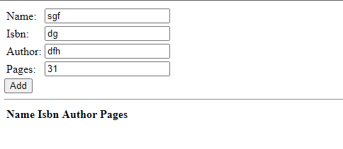

## **Documentation for Project 4 MEAN Stack Deployment**

### nodejs Installation 
`sudo apt update`
### Adding Certificates
`sudo apt -y install curl dirmngr apt-transport-https lsb-release ca-certificates`

`curl -sL https://deb.nodesource.com/setup_12.x | sudo -E bash - `

`sudo apt install -y nodejs`

### MongoDB Installation 
`sudo apt install -y mongodb`

### MongoDB Installed and Running 
`sudo service mongodb start`

`sudo systemctl status mongodb`

### NPM Installation and body parser
`sudo apt install -y npm`
`sudo npm install body-parser`

## Step 2

### Mongoose Installation
`sudo npm install express mongoose`

### Book Register app Live on web

